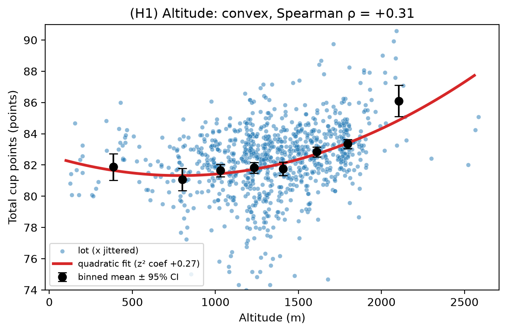
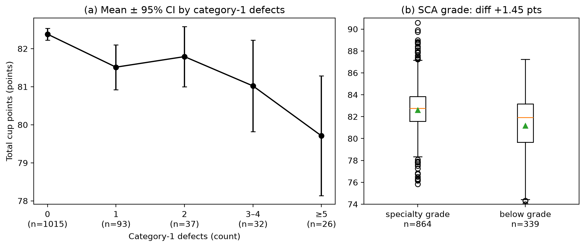
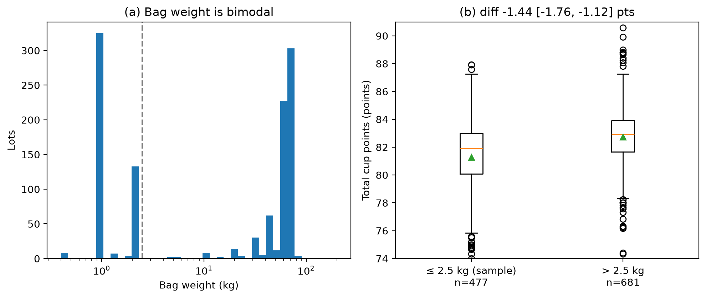
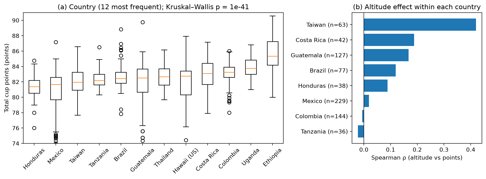
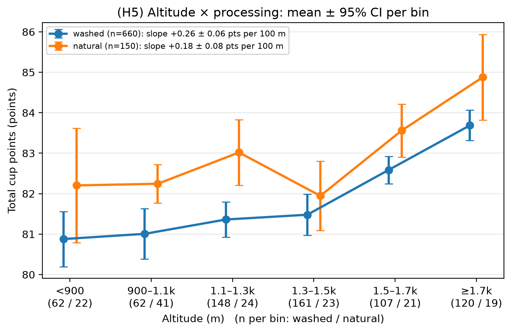
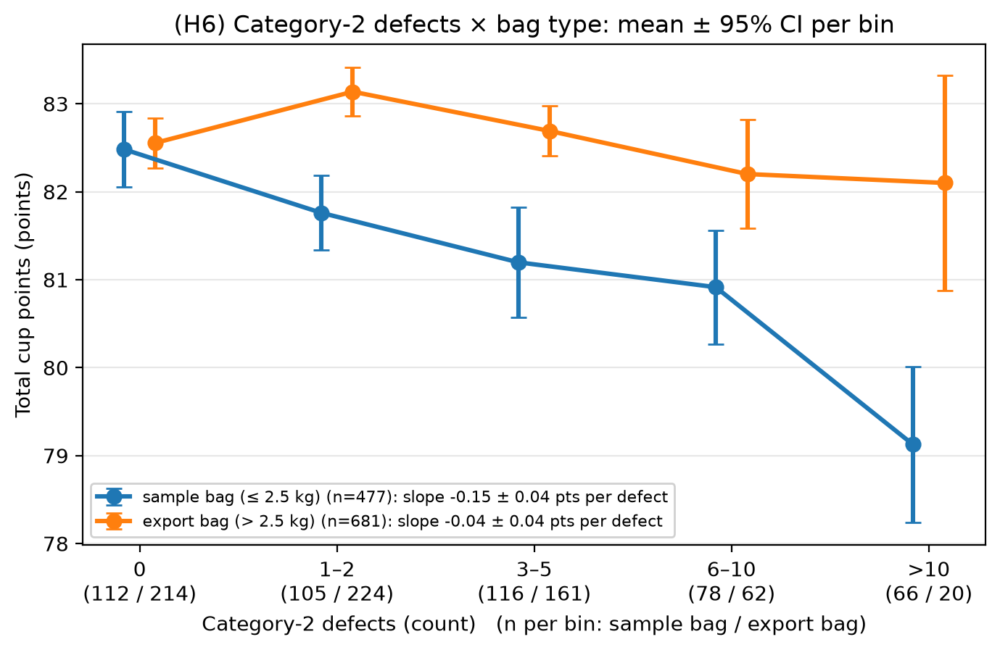
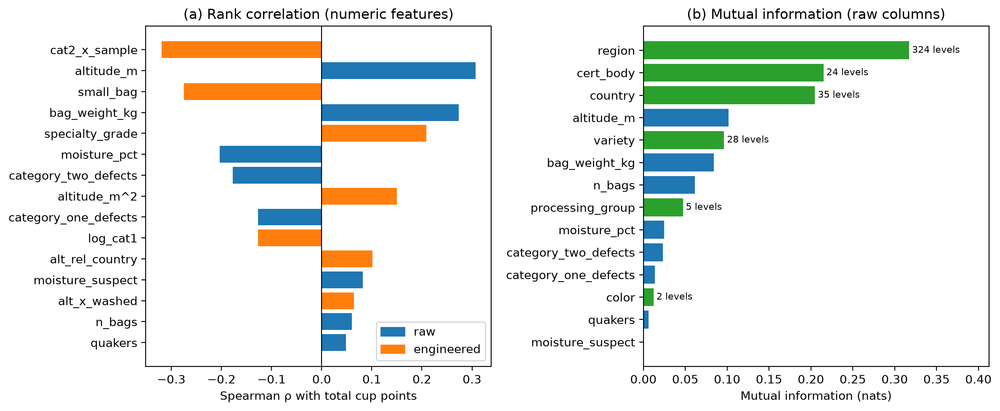
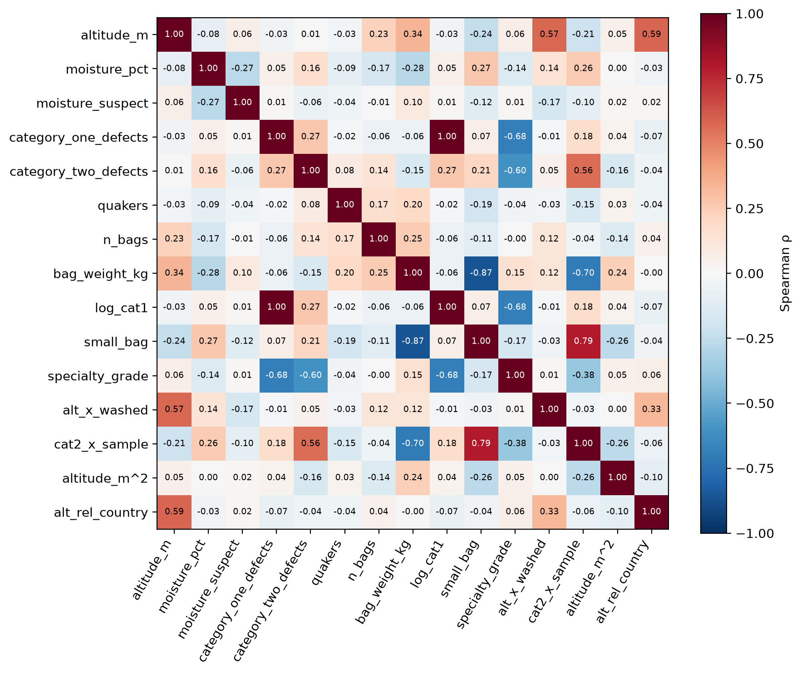
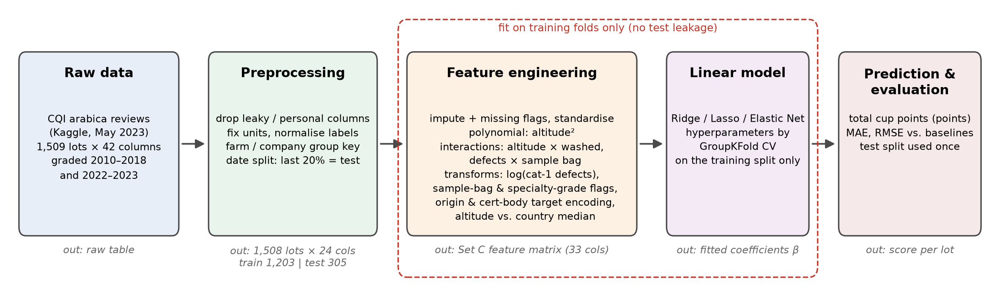

# 特徵工程(§4–§5.1)

我們把資料依評鑑日期排序,最後 20% 留作測試集(2017-05-11 以後,共 305 筆),前面 1,203 筆是訓練集。**以下所有觀察都只看訓練集**,測試集完全沒碰。

每個新特徵都要說得出兩件事:**資料上看到了什麼**,以及**為什麼這樣合理**。至於特徵最後到底有沒有讓預測變準,留到 §7 實驗再比較。

## §4 從資料看到的現象

(H1 的散布圖中,海拔多半是整數百公尺,很多點會疊在同一位置,所以畫圖時讓點左右稍微錯開;只影響畫面,不影響任何計算。)

### H1 海拔越高分數越高,但不是等速上升 → 加入「海拔的平方」

- **資料顯示**:海拔 1,500 公尺以下,分數幾乎沒變(平均約 81.8 分);超過 1,500 公尺後開始上升,1,900 公尺以上平均到 86.1 分。圖上的點連起來是一條往上彎的曲線,不是直線。
- **為什麼合理**:高海拔比較冷,咖啡果實長得慢,風味通常比較好;但這個好處要到夠高的海拔才明顯。
- **做法**:線性模型只能畫直線,多放一個「海拔的平方」,模型就能畫出往上彎的曲線。→ `altitude_m^2`

### H2 嚴重瑕疵「有沒有」比「有幾顆」更重要 → 改用 log,並加上精品等級標記

- **資料顯示**:沒有第一類瑕疵(嚴重瑕疵)的批次平均 82.4 分,只要出現 1 顆就掉到 81.5 分;之後再多幾顆,分數掉得比較慢。另外,84% 的批次一顆都沒有。符合精品等級的批次平均高 1.45 分。
- **為什麼合理**:像全黑豆、全酸豆這種嚴重瑕疵,一顆就足以讓整杯咖啡出現怪味,所以第一顆的傷害最大。精品咖啡協會(SCA)的分級也是用「沒有嚴重瑕疵、輕微瑕疵不超過 5 顆」當精品門檻(待查證原始文件)。
- **做法**:取 log 讓「0 → 1 顆」的差距變大、「10 → 11 顆」的差距變小;再加一個「是否符合精品等級」的是非欄位。→ `log_cat1`、`specialty_grade`

### H3 袋重其實分成兩種人送的豆子 → 改成「是否為樣品袋」

- **資料顯示**:袋重幾乎只有兩種:1–2 公斤左右(佔 41%)和 60–69 公斤左右,中間很少。小袋的批次平均比大袋低 1.44 分。
- **為什麼合理**:1–2 公斤的是寄來測試的樣品袋,多半是小農或小批次;60–69 公斤是出口用的標準麻袋,多半是出口商的整批貨。兩者是不同類型的送測者,「袋子多重」這個數字本身沒有「越重越好」的意思。
- **做法**:把袋重改成「是不是樣品袋(2.5 公斤以下)」的是非欄位。→ `small_bag`

### H4 產地本身就影響分數 → 用「同產地的平均分數」代表產地,並比較同國內的海拔

- **資料顯示**:不同國家的平均分數差很多,最低的宏都拉斯 80.4 分,最高的衣索比亞 85.6 分。而在同一個國家內,海拔對分數的影響有強有弱:台灣很明顯,哥倫比亞幾乎沒有。產區有 324 種,大多數只出現幾次。
- **為什麼合理**:不同產地的氣候、土壤、栽種習慣不同(所謂「風土」)。同樣 1,500 公尺,在赤道附近和在台灣的氣溫不一樣,所以海拔應該跟同國家的其他產區比才有意義。
- **做法**:
  - 產國、產區、品種不用「一個類別開一欄」(產區會變成幾百欄),改成「訓練資料中同類別的平均分數」;出現次數很少的類別,會自動往整體平均靠攏,避免被一兩筆資料帶偏。
  - 再加一欄「這批豆子的海拔,比它所在國家的一般海拔高多少」。
  - → 產國 / 產區 / 品種的平均分數編碼、`alt_rel_country`

### H5 水洗豆的海拔效果比日曬豆強 → 加入「海拔 × 是否水洗」

- **怎麼看這張圖**:把海拔切成幾段,每段分別算水洗豆(藍)和日曬豆(橘)的平均分數,每個點上下的短線是誤差範圍(95% 信賴區間)。x 軸下方括號是每段的筆數。兩條線如果平行,代表海拔對兩種豆子的影響一樣;不平行就代表不一樣。
- **資料顯示**:換算成斜率,海拔每高 100 公尺,水洗豆多 0.26 分,日曬豆只多 0.18 分。但分段來看兩條線大致平行(從最低到最高一段,水洗豆上升 2.8 分、日曬豆上升 2.7 分),兩組斜率的誤差範圍也有重疊。這是六個假設中證據最弱的一個,§8 要再確認。
- **為什麼合理**:水洗會先把果肉去掉,喝起來比較接近豆子本身的味道,海拔帶來的差異比較容易顯現;日曬豆的果香比較重,會蓋掉一部分海拔的差異。
- **做法**:線性模型預設「海拔的影響對每種豆子都一樣」,加入「海拔 × 是否水洗」這一欄,模型才能讓水洗豆的斜率不同。→ `alt_x_washed`

### H6 同樣的瑕疵,樣品袋扣分比出口袋重 → 加入「輕微瑕疵數 × 是否樣品袋」

- **怎麼看這張圖**:同 H5,藍線是樣品袋、橘線是出口袋。
- **資料顯示**:沒有瑕疵時兩者分數一樣(約 82.5 分);瑕疵越多,樣品袋的分數一路往下掉,超過 10 顆時只剩 79.1 分,出口袋卻幾乎沒變(82.1 分)。換算成斜率,每多 1 顆第二類(輕微)瑕疵,樣品袋扣 0.15 分,出口袋只扣 0.04 分。
- **為什麼合理**(兩種可能,§8 再討論):
  1. **送測者不同**:出口批次出貨前通常在處理廠篩過一次,剩下的多是外觀上的小瑕疵;樣品袋多來自小農或小批次,瑕疵比較可能是處理過程出了問題,而這些問題也會影響風味。
  2. **抽樣代表性**:瑕疵是從 350 公克樣品數出來的。對 1 公斤的樣品袋,350 公克就是批次的一大部分,瑕疵數很能代表整批;對幾百袋、每袋 69 公斤的出口批次,350 公克只佔極小比例,瑕疵數的雜訊大,和分數的關係自然變弱。
- **做法**:同 H5,讓樣品袋的瑕疵斜率可以不同。→ `cat2_x_sample`

### 整體來看


- 跟分數關係最強的三個欄位是產區、評鑑機構、產國,產地相關欄位排在前面,支持 H4。
- 有些新特徵是從同一個原始欄位變出來的,彼此高度相關(例如「瑕疵數」和「瑕疵數取 log」)。這種情況下一般的線性回歸係數會不穩定,所以 §5.2 建議用 Ridge(會把係數往 0 收縮,讓結果比較穩)。

## §5.1 資料怎麼一步步變成預測


| 類型 | 新特徵 | 來自哪個發現 |
|---|---|---|
| 多項式 | 海拔的平方 | H1 |
| 交互作用 | 海拔 × 是否水洗、輕微瑕疵數 × 是否樣品袋 | H5、H6 |
| 轉換 | 嚴重瑕疵取 log、是否精品等級、是否樣品袋 | H2、H3 |
| 轉換(產地) | 產國 / 產區 / 品種的平均分數、相對同國的海拔 | H4 |

- 原始欄位包含團隊決定納入的 `quakers`(Quaker 豆數)與 `cert_body`(評鑑機構)。評鑑機構類別多,在 Set C 和產國 / 產區 / 品種一樣改用平均分數編碼。
- **Set A**(對照組):只用原始欄位,類別一個值開一欄,共 97 欄。
- **Set C**(我們的):原始數值欄位 + 上表的新特徵,共 33 欄。
- 所有需要「從資料算出來」的東西(平均分數、補缺值用的中位數等)都只用訓練資料算,不偷看要預測的資料。
- `build_features("C", drop_group=...)` 可以一次拿掉一類特徵,給 §7 比較每類特徵的貢獻。

## 重現
```
python src/make_split.py && python src/eda.py && python src/features.py && python src/plot_pipeline.py
```
